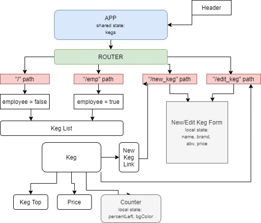

# _Tip Top Tap Room_

#### _Inventory management and beer list for a fictional tap room, February 14th 2020_

#### By _**Liam Kenna**_

## Description

_This application was built as part of a larger project and is at this time not completed. Layout and design choices have been made but forms and state management have not yet been integrated. Please check back for future updates._

## Setup/Installation Requirements

* _Clone to local machine_
* _Navigate to project folder_
* _Run $ yarn install_
* _Run $ yarn start_

## Known Bugs

_No known bugs at this time_

## Support and contact details

_Any issues or concerns, please email liam@liamkenna.com_

## Technologies Used

_JavaScript, React, React-Router, Material-UI, HTML, CSS_

### License

*This software is available under the MIT License*

Copyright (c) 2020 **_Liam Kenna_**

This project was bootstrapped with [Create React App](https://github.com/facebook/create-react-app).

